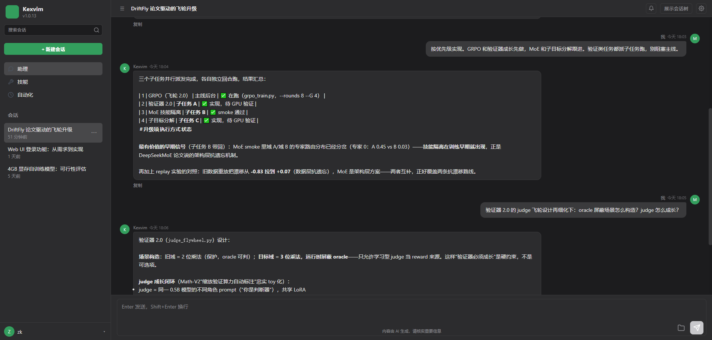
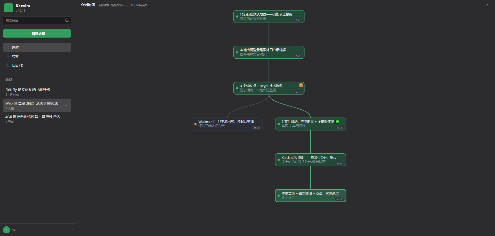
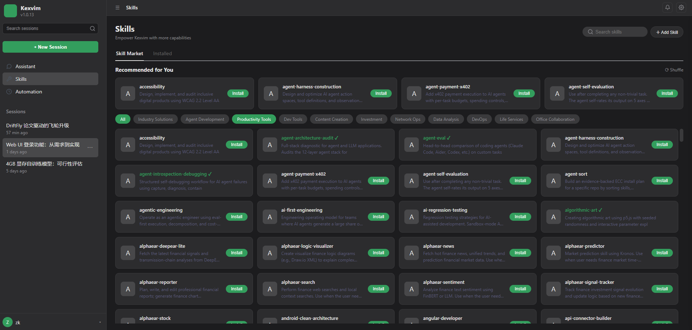
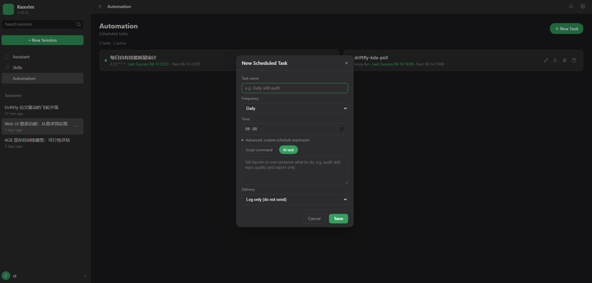
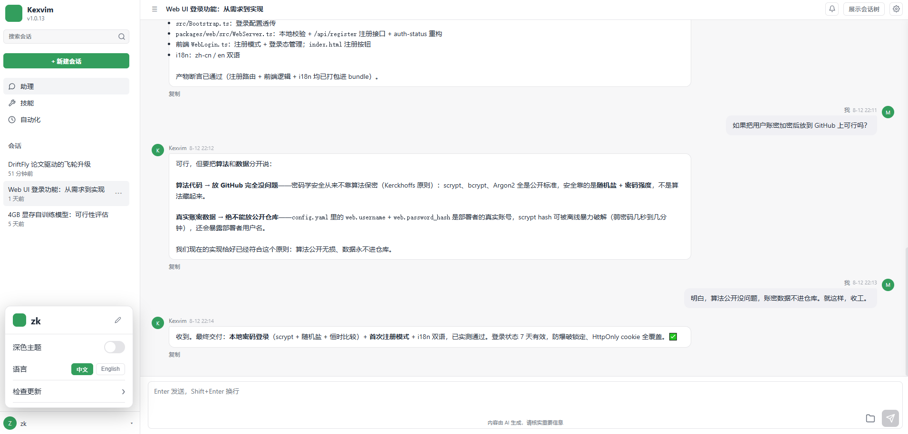

# Kexvim — A Multi-Specialist AI Assistant Deployed on Your Device

[](LICENSE)

**English** | [简体中文](README.zh-CN.md)

**Kexvim** is a local-first AI Agent framework: it chats like a smart assistant and autonomously handles coding, file operations, terminal commands, web search, scheduled tasks, and more. Built with Node.js/TypeScript — single-process, multi-threaded, ready to use out of the box.

<p align="center">
  
</p>

## Features

- **Multi-platform access**: QQ bot, Web UI chat panel, terminal — run once, use everywhere
- **Multi-model support**: DeepSeek and other mainstream LLMs (OpenAI-compatible protocol) with streaming, tool calling, and vision analysis
- **Tool system**: 30+ built-in tools — file read/write, precise patching, terminal, web search/fetch, code execution, image generation, image analysis
- **Skill system**: 200+ pluggable skills (progressive disclosure, loaded on demand) covering development, ops, documentation, and research
- **Long-term memory**: fact memory + user profile persistence — remembers you across sessions
- **Conversation tree**: messages organized as a branching tree — fork any message into a new branch and switch back anytime (original content never lost); branch summaries generated automatically, tree navigation in the Web panel
- **Session management**: SQLite persistence, switch/resume historical sessions anytime
- **Scheduled tasks**: built-in cron scheduler (shell commands / autonomous agent runs)
- **Daemon**: auto-start on boot, crash self-healing, one-command `kexvim restart` (main process + Web)
- **Cross-platform**: Windows / Linux / macOS

## Screenshots

| Conversation Tree | Skill Market |
|---|---|
|  |  |

## Requirements

- Node.js **22+** (uses built-in `node:sqlite`, no database installation needed)
- Windows / Linux / macOS

## One-Click Install

### Windows

Download [kexvim-install.bat](https://github.com/mosike99/kexvim/raw/main/kexvim-install.bat?download=1) and double-click to run.

First run automatically: downloads core files → installs dependencies → guides API Key setup.

### Linux / macOS

```bash
curl -fsSL https://github.com/mosike99/kexvim/raw/main/kexvim-install.sh -o kexvim-install.sh && chmod +x kexvim-install.sh
./kexvim-install.sh
```

After install, type `kexvim` in your terminal.

## Quick Start

1. **Initialize**: `kexvim init` — configure API Key (DeepSeek etc.)
2. **Start**: `kexvim restart` — launch the daemon and Web UI
3. **Chat**: open `http://localhost:8788` in your browser, or talk directly via the configured QQ bot

## CLI Commands

| Command | Description |
|------|------|
| `kexvim init` | First-time setup (API Key + config + PATH) |
| `kexvim restart` | Restart the main program (daemon + web) |
| `kexvim stop` | Stop the main program (daemon + web) |
| `kexvim status` | Show run status / auto-start config / restart-loop protection |
| `kexvim sessions` | List all historical sessions |
| `kexvim session <8-digit-id>` | Switch/resume a historical session |
| `kexvim install` / `uninstall` | Install / remove auto-start on boot |
| `kexvim clear-loop` | Clear restart-loop protection |
| `kexvim help` | Show help |

## Configuration

Configuration lives in the `data/` directory of your install:

- **`data/.env`** — secrets: `DEEPSEEK_API_KEY=sk-xxx`
- **`data/config.yaml`** — LLM provider, agent behavior, session reset policy, platform adapters (QQ), language

Useful environment variables (each overrides the default):

| Variable | Default | Description |
|------|--------|------|
| `KEXVIM_PROVIDER` | `deepseek` | Default LLM provider |
| `KEXVIM_MODEL` | `deepseek-v4-flash` | Default model |
| `KEXVIM_WEB_PORT` | `8788` | Web UI port |
| `KEXVIM_LANGUAGE` | `zh-CN` | Interface language (`zh-CN` / `en`) |

## Architecture

- **Single-process multi-threading**: Worker Threads in parallel, zero IPC overhead
- **Event-driven**: AgentRuntime main loop + tool execution + message push decoupled
- **Adapter pattern**: platform adapters (QQ / Web / terminal) and LLM provider abstraction — extend by adding adapters
- **Skills / memory**: progressive-disclosure skill library, layered memory persistence

## More Screenshots

<details>
<summary>Task execution, light theme and more (click to expand)</summary>

| Task execution | Light theme chat page |
|---|---|
|  |  |

</details>

## License

[MIT](LICENSE)
