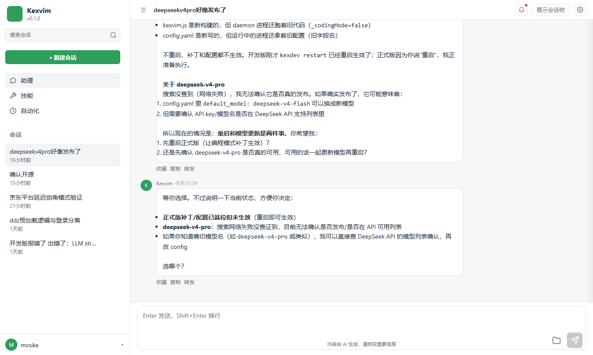

# Kexvim — A Multi-Specialist AI Assistant Deployed on Your Device
# Kexvim — 部署在你设备上的多专业 AI 助手

[](LICENSE)

**Kexvim** is a local-first AI Agent framework: it chats like a smart assistant and autonomously handles coding, file operations, terminal commands, web search, scheduled tasks, and more. Built with Node.js/TypeScript — single-process, multi-threaded, ready to use out of the box.

**Kexvim** 是一个运行在你本地设备上的 AI Agent 框架：既能像智能助手一样聊天问答，也能自动完成代码、文件、终端、搜索、定时任务等复杂工作。基于 Node.js/TypeScript 构建，单进程多线程架构，开箱即用。

---

## Screenshot 界面预览



*Web UI chat panel — 浏览器访问 `http://localhost:8788` 即可聊天*

---

## Features 特性

- **Multi-platform access 多平台接入**: QQ bot, Web UI chat panel, terminal — run once, use everywhere / QQ 机器人、Web UI 聊天面板、终端交互，一处运行多端可用
- **Multi-model support 多模型支持**: DeepSeek and other mainstream LLMs (OpenAI-compatible protocol) with streaming, tool calling, and vision analysis / DeepSeek 等主流 LLM（OpenAI 兼容协议），流式对话 + 工具调用 + 视觉分析
- **Tool system 工具系统**: 30+ built-in tools — file read/write, precise patching, terminal, web search/fetch, code execution, image generation, image analysis / 30+ 内置工具——文件读写、精准编辑、终端命令、网页搜索/抓取、代码执行、图像生成、图片分析等
- **Skill system 技能系统**: 200+ pluggable skills (progressive disclosure, loaded on demand) covering development, ops, documentation, and research / 200+ 可插拔技能（渐进披露、按需检索加载），覆盖开发、运维、文档、研究等领域
- **Long-term memory 长期记忆**: fact memory + user profile persistence — remembers you across sessions / 事实记忆 + 用户画像持久化，跨会话记得你
- **Conversation tree 会话树**: messages organized as a branching tree — fork any message into a new branch and switch back anytime (original content never lost) / 对话以树形分支组织——任意消息可分叉出新分支，随时切回历史分支继续对话（原分支内容不丢）
- **Session management 会话管理**: SQLite persistence, switch/resume historical sessions anytime / SQLite 持久化，历史会话随时切换/恢复
- **Scheduled tasks 定时任务**: built-in cron scheduler (shell commands / autonomous agent runs) / 内置 cron 调度（shell 命令 / agent 自动执行两种模式）
- **Daemon 守护进程**: auto-start on boot, crash self-healing, one-command `kexvim restart` (main process + Web) / 开机自启、崩溃自愈、`kexvim restart` 一键重启（主进程 + Web 一并重启）
- **Cross-platform 跨平台**: Windows / Linux / macOS

## Requirements 环境要求

- Node.js **22+** (uses built-in `node:sqlite`, no database installation needed / 使用内置 `node:sqlite`，无需安装数据库)
- Windows / Linux / macOS

## One-Click Install 一键安装

### Windows

Download [kexvim-install.bat](https://github.com/mosike99/kexvim/raw/main/kexvim-install.bat?download=1) and double-click to run.

下载 [kexvim-install.bat](https://github.com/mosike99/kexvim/raw/main/kexvim-install.bat?download=1)，双击运行。

First run automatically: downloads core files → installs dependencies → guides API Key setup.

首次运行自动：下载核心文件 → 安装依赖 → 引导配置 API Key。

### Linux / macOS

```bash
curl -fsSL https://github.com/mosike99/kexvim/raw/main/kexvim-install.sh -o kexvim-install.sh && chmod +x kexvim-install.sh
./kexvim-install.sh
```

After install, type `kexvim` in your terminal.

安装完成后，终端输入 `kexvim` 即可使用。

## Quick Start 快速上手

1. **Initialize**: `kexvim init` — configure API Key (DeepSeek etc.) / 配置 API Key
2. **Start**: `kexvim restart` — launch the daemon and Web UI / 拉起主程序（daemon）与 Web UI
3. **Chat**: open `http://localhost:8788` in your browser, or talk directly via the configured QQ bot / 浏览器打开 `http://localhost:8788`，或通过已配置的 QQ 机器人直接对话

## CLI Commands 命令行

| Command 命令 | Description 说明 |
|------|------|
| `kexvim init` | First-time setup (API Key + config + PATH) / 首次安装初始化（API Key + 配置 + PATH） |
| `kexvim restart` | Restart the main program (daemon + web) / 重启主程序（daemon + web 一并重启） |
| `kexvim stop` | Stop the main program (daemon + web) / 停止主程序（daemon + web） |
| `kexvim status` | Show run status / auto-start config / restart-loop protection / 查看运行状态 / 自启配置 / 重启循环防护 |
| `kexvim sessions` | List all historical sessions / 列出所有历史会话 |
| `kexvim session <8-digit-id>` | Switch/resume a historical session / 切换/恢复历史会话 |
| `kexvim install` / `uninstall` | Install / remove auto-start on boot / 安装 / 移除开机自启 |
| `kexvim clear-loop` | Clear restart-loop protection / 解除重启循环防护 |
| `kexvim help` | Show help / 查看帮助 |

## Configuration 配置

Configuration lives in the `data/` directory of your install / 配置位于安装目录 `data/` 下：

- **`data/.env`** — secrets: `DEEPSEEK_API_KEY=sk-xxx` / 敏感信息
- **`data/config.yaml`** — LLM provider, agent behavior, session reset policy, platform adapters (QQ), language (`language: en`) / LLM provider、Agent 行为、会话重置策略、平台适配器（QQ）、语言

Useful environment variables (each overrides the default / 常用环境变量，均可覆盖默认值):

| Variable 变量 | Default 默认值 | Description 说明 |
|------|--------|------|
| `KEXVIM_PROVIDER` | `deepseek` | Default LLM provider / 默认 LLM provider |
| `KEXVIM_MODEL` | `deepseek-v4-flash` | Default model / 默认模型 |
| `KEXVIM_WEB_PORT` | `8788` | Web UI port / Web UI 端口 |
| `KEXVIM_LANGUAGE` | `zh-CN` | Interface language (`zh-CN` / `en`) / 界面语言 |

## Architecture 架构

- **Single-process multi-threading**: Worker Threads in parallel, zero IPC overhead / 单进程多线程：Worker Threads 并行处理，零 IPC 开销
- **Event-driven**: AgentRuntime main loop + tool execution + message push decoupled / 事件驱动：AgentRuntime 主循环 + 工具执行 + 消息推送解耦
- **Adapter pattern**: platform adapters (QQ / Web / terminal) and LLM provider abstraction — extend by adding adapters / 适配器模式：平台适配层（QQ / Web / 终端）与 LLM Provider 抽象，扩展只需新增适配器
- **Skills / memory**: progressive-disclosure skill library, layered memory persistence / 技能/记忆：技能库渐进披露，记忆分层持久化

## License 开源协议

[MIT](LICENSE)
